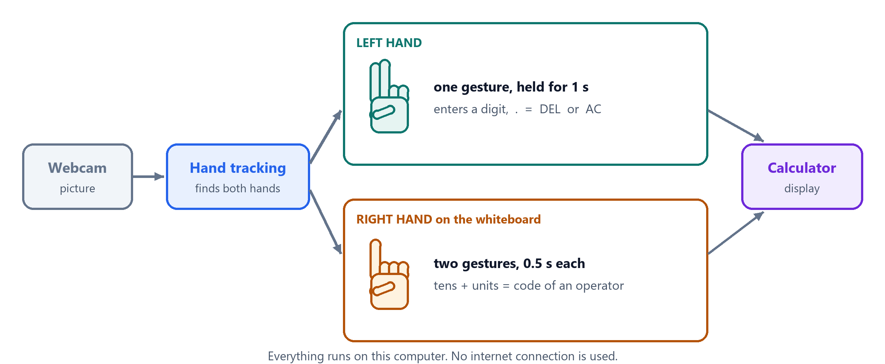
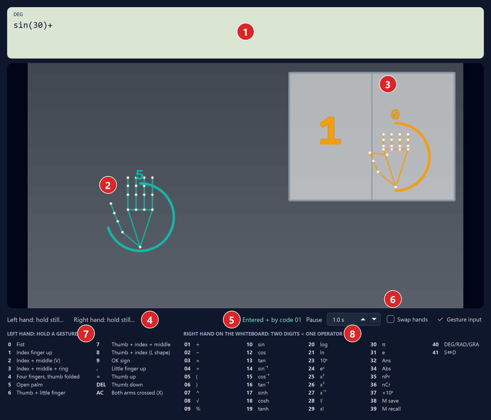
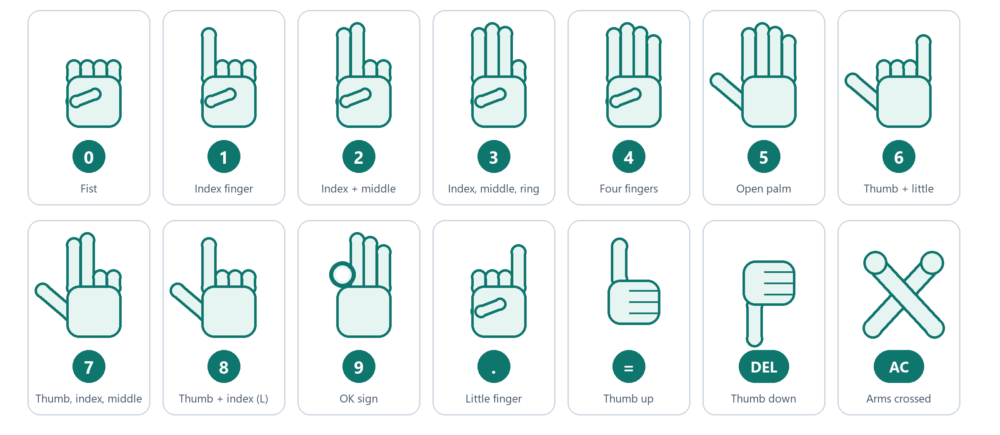
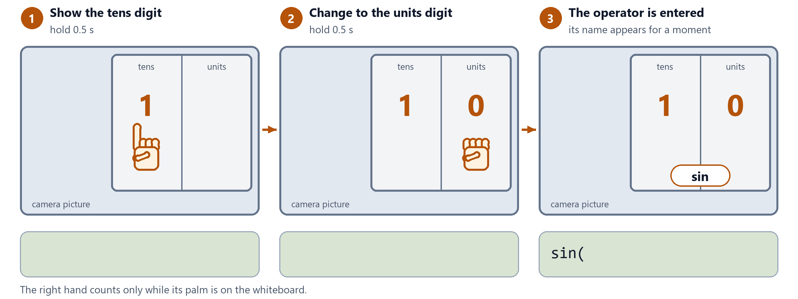
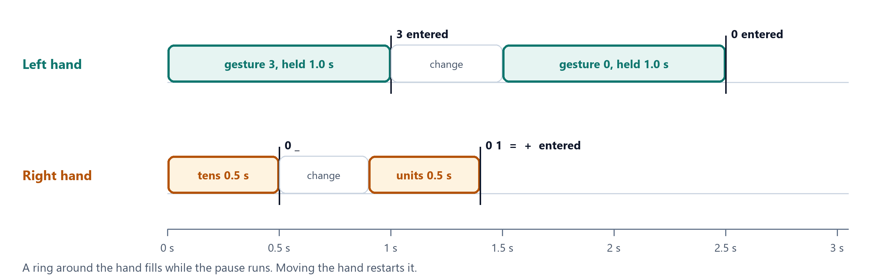
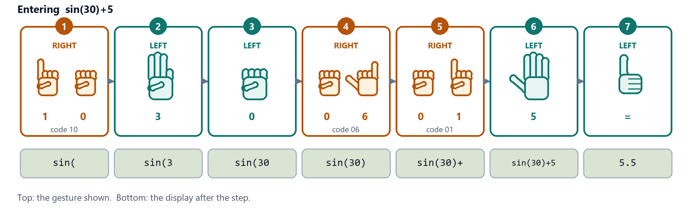
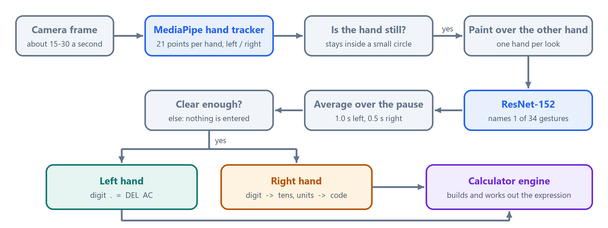
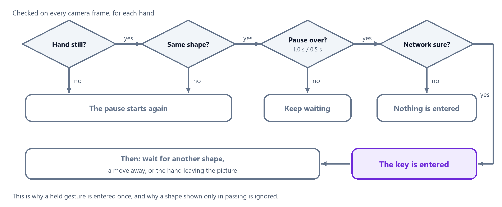
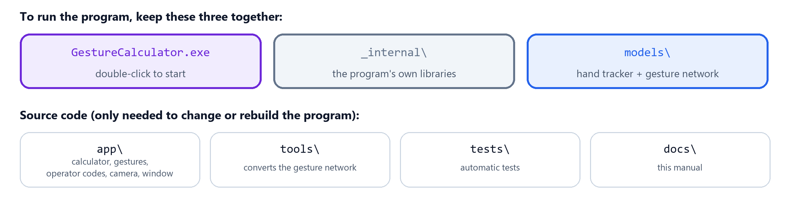

# Gesture Calculator

> **Note:** This repository is a rebuilt version of the "Gesture Recognition Calculator" project listed on my resume, re-implemented with current tools and libraries.

A scientific calculator you operate with hand gestures in front of a webcam. It is a Windows program that runs
**entirely offline**: the neural network is stored on the computer, no picture leaves it, and the program writes
no files.



| Hand | What it shows | What is entered |
|---|---|---|
| **Left hand** | one gesture, held still for 1 second | a digit, `.`, `=`, DEL or AC |
| **Right hand**, on the whiteboard | two digit gestures, 0.5 second each, tens first | the operator with that two-digit code |

All gestures are recognised by a pre-trained **ResNet-152** (HaGRIDv2). The keyboard works as well. Open source,
for non-commercial use ([licence](LICENSE.md)). A printable version of this guide is [manual.docx](manual.docx).

**Contents:** [Get it](#get-it) · [The window](#the-window) · [Left hand](#left-hand-digits-and-editing) ·
[Right hand](#right-hand-operators) · [Timing and example](#timing-and-a-worked-example) ·
[Settings and keyboard](#settings-and-keyboard) · [Calculator functions](#calculator-functions) ·
[How it works](#how-it-works) · [Files and source code](#files-and-source-code) ·
[Troubleshooting](#troubleshooting) · [Limitations](#limitations) · [Licence](#licence-and-credits)

## Get it

Download `GestureCalculator-windows.zip` from [Releases](../../releases), unzip it and double-click
`GestureCalculator.exe`.

| Item | Requirement |
|---|---|
| Computer | Windows 10 or 11, 64-bit |
| Camera | any webcam (the built-in one of a laptop is fine) |
| Installation | none: no Python, no internet connection |

Then wait a few seconds until the camera picture appears, and sit 40–80 cm from the camera, in good light, with
both hands able to reach into the picture.

## The window



| No. | Part | What it does |
|---|---|---|
| 1 | Display | expression on the first line, result on the right; `DEG` / `RAD` / `GRA` and `M` (memory in use) at the top left |
| 2 | Left hand | green outline; the ring fills while the gesture is held, the guessed key is shown above it |
| 3 | Whiteboard | two halves: tens digit on the left, units digit on the right; the right hand has an orange outline |
| 4 | Hints | what each hand should do next |
| 5 | Last entry | what was just entered, or why a gesture was not accepted |
| 6 | Settings | Pause, Swap hands, Gesture input |
| 7 | Gesture list | the gestures of the left hand |
| 8 | Code list | the two-digit code of every operator |

## Left hand: digits and editing

The left hand enters the digits, the decimal point, `=`, DEL and AC. Hold a gesture still for **1 second**. A
green ring fills around the hand; when it is full, the key is entered.



| To do this | Do this |
|---|---|
| Enter the next character | change to the next gesture and hold it |
| Enter the same character twice (`55`) | after the first one, move the hand aside and back, then hold the gesture again |
| Delete the last character | thumb down (DEL) |
| Clear everything | cross both forearms, away from the whiteboard (AC) |
| Work out the result | thumb up (`=`) |

A held gesture is entered only once. A hand shape shown only in passing, on the way to the next gesture, is
ignored.

## Right hand: operators

The whiteboard is the light panel in the top right of the camera picture. Put the right hand on it and show
**two digits**, each for **0.5 second**: first the tens digit, then the units digit. The digit gestures are the
same as for the left hand; an orange ring shows the time running.



- The right hand counts only while its palm is on the whiteboard, and it can only enter code digits.
- A code that does not exist enters nothing.

| To correct this | Do this |
|---|---|
| A wrong tens digit | take the hand off the whiteboard; after 6 seconds the digit is dropped |
| A wrong operator | delete it with the left hand (thumb down, DEL) |

**The codes**

| 0x  Basic | 1x  Trigonometry | 2x  Logs, powers | 3x  Constants, other | 4x  Settings |
|---|---|---|---|---|
| `01` + | `10` sin | `20` log | `30` π | `40` DEG / RAD / GRA |
| `02` − | `12` cos | `21` ln | `31` e | `41` decimal ⇔ fraction |
| `03` × | `13` tan | `23` 10ˣ | `32` Ans | |
| `04` ÷ | `14` sin⁻¹ | `24` eˣ | `34` Abs | |
| `05` ( | `15` cos⁻¹ | `25` x² | `35` nPr | |
| `06` ) | `16` tan⁻¹ | `26` x³ | `36` nCr | |
| `07` ^ | `17` sinh | `27` x⁻¹ | `37` ×10ˣ | |
| `08` √ | `18` cosh | `28` ∛ | `38` save to memory | |
| `09` % | `19` tanh | `29` x! | `39` recall memory | |

The tens digit names the group. There are no codes with the same digit twice (11, 22, 33), so the hand never has
to show one gesture twice in a row. The same list is printed in the window.

## Timing and a worked example

The pause starts when the hand is still and its shape no longer changes. Moving the hand or changing the gesture
starts it again.



In the example below, orange steps are made by the right hand (a code), green steps by the left hand.



## Settings and keyboard

| Setting | Effect |
|---|---|
| Pause | how long the left hand must be still (1.0 s at the start, 0.4–2.0 s); the right hand always needs half of it |
| Swap hands | for left-handed use: digits with the right hand, operator codes with the left hand |
| Gesture input | untick to pause gesture input; the camera picture keeps running |

The keyboard always works as well:

| Keys | Enter |
|---|---|
| `0`–`9` `.` `+ - * / ( ) ^ ! %` | the same characters |
| Enter or `=` | the result |
| Backspace / Esc | DEL / AC |
| `D` / `F` | angle unit / decimal ⇔ fraction |

## Calculator functions

| Group | Functions |
|---|---|
| Arithmetic | + − × ÷, parentheses, %, ×10ˣ |
| Powers and roots | x², x³, xʸ (`^`), x⁻¹, √, ∛ |
| Trigonometry | sin, cos, tan, their inverses, sinh, cosh, tanh; angles in DEG, RAD or GRA |
| Logarithms | log, ln, 10ˣ, eˣ |
| Counting | x!, nPr, nCr, Abs |
| Constants, memory | π, e, Ans (the last result), one memory (save, recall) |

| Rule | Example |
|---|---|
| A missing × is understood | `2π`, `3sin(30)` |
| A missing `)` at the end is allowed | `sin(30` gives 0.5 |
| After `=`, an operator continues from the result | `6×7=` then `+8` shows `Ans+8` |
| After `=`, a digit starts a new calculation | `6×7=` then `3` shows `3` |
| Results have 10 significant digits | `1÷3` gives 0.3333333333 |
| What cannot be worked out | `Math ERROR` (such as 1÷0) or `Syntax ERROR` (such as `1+`); DEL returns to the expression |

"Save to memory" stores the result (working out an unfinished expression first); "recall memory" puts the stored
value into the expression.

Not included: matrix, vector, statistics, complex-number and base-N modes, equation solving, integration.

## How it works

### From the camera picture to a key



| Step | What it does |
|---|---|
| Hand tracking | MediaPipe finds up to two hands, 21 points on each, and tells the left hand from the right. The picture is mirrored, so the right hand appears on the right. |
| Stillness | A hand is still while its palm and index fingertip stay inside a small circle. This tolerates the slight tremor of a raised hand. |
| One hand per look | The gesture network judges the whole picture and names one gesture. So each hand gets its own look, with the other hand painted over in grey. |
| Gesture network | ResNet-152, a deep convolutional network pre-trained on the HaGRID gesture data set, gives a probability to each of 34 gestures. |
| Averaging | The answers for all frames of the pause are averaged, so one bad frame does not decide. |
| Calculator | The key is added to the expression; `=` works it out. |

### When a gesture is entered



"Network sure" means: the calculator's gestures together receive at least 30% of the probability, and the best
one at least half of that. Otherwise nothing is entered and the window shows the closest guess.

### The models

The files live in `models/` and run on the processor with ONNX Runtime / MediaPipe; no graphics card is needed.
Nothing is trained: the gesture networks are the published HaGRID models, converted to the ONNX format.

| File | What it is | Where it comes from |
|---|---|---|
| `hand_landmarker.task` | MediaPipe hand tracker (21 landmarks per hand): finds both hands and tells left from right | Google, pre-trained; in this repository |
| `gesture_resnet152.onnx` | **ResNet-152** full-frame gesture classifier, 34 classes, pre-trained on HaGRIDv2 (1 M images); published F1 98.6. Used by default | HaGRID checkpoint, converted with `tools/convert_hagrid.py --arch resnet152` |
| `gesture_vit_b16.onnx` | **ViT-B/16**, a vision transformer trained on the same data; published F1 91.7. Optional alternative | `tools/convert_hagrid.py --arch vit_b16` |

Measured on the development laptop (CPU): ResNet-152 36 ms per frame, ViT-B/16 67 ms, hand tracking 8 ms. The
laptop's webcam delivers about 15 pictures a second indoors.

## Files and source code



To use the calculator on another computer, copy `GestureCalculator.exe`, `_internal` and `models` together. The
program writes no files: nothing is recorded or stored.

### Run from the source code

The two gesture networks are **not in this repository** (233 MB and 344 MB, above GitHub's file size limit); the
release zip contains ResNet-152. From the source code, step 2 creates it once: the script downloads the published
HaGRID model and converts it. This step needs the internet; running the calculator does not.

```powershell
# 1. environment
py -3.12 -m venv .venv
.venv\Scripts\python -m pip install -r requirements.txt

# 2. the gesture network, once
.venv\Scripts\python -m pip install -r tools\requirements-convert.txt
.venv\Scripts\python tools\convert_hagrid.py --arch resnet152     # -> models\gesture_resnet152.onnx

# 3. start
.venv\Scripts\python app\main.py
```

| Option | Effect |
|---|---|
| `--camera 1` | use another webcam |
| `--no-camera` | keyboard only |
| `--gesture-model vit_b16` | use ViT-B/16 instead of ResNet-152 (convert it first with `--arch vit_b16`) |

### Build the exe

```powershell
.venv\Scripts\python -m pip install pyinstaller
pwsh build_exe.ps1                          # -> GestureCalculator.exe and _internal\ in the project folder
```

### Folders

| Folder | Content |
|---|---|
| `app/` | `engine.py` calculator, `operators.py` operator codes, `gestures.py` gesture → key, `controller.py` input logic, `vision.py` camera thread, `models.py` ONNX model, `ui.py` window |
| `tools/` | `convert_hagrid.py` (checkpoint → ONNX) |
| `tests/` | calculator engine, operator codes and input-logic tests (`pytest`) |
| `docs/` | the pictures of this guide and the sources of `manual.docx` (`update_manual.ps1` rebuilds it) |

## Troubleshooting

| Problem | What to do |
|---|---|
| "No webcam found" | connect a camera, close other programs that use it, start again; or start with `--camera 1` |
| "gesture model missing" | put `gesture_resnet152.onnx` and `gesture_resnet152.json` into `models` |
| No outline on a hand | bring the whole hand into the picture; improve the light |
| The ring never fills | hold the hand still; rest the elbow on the table |
| "Gesture not recognised" | face the palm to the camera, spread the fingers clearly, keep the other hand away from it |
| A digit is entered twice | keep the hand still after an entry until you change the gesture |
| The right hand enters nothing | its palm must be on the whiteboard |
| The hands are taken for each other | keep them apart; if it is always wrong, tick Swap hands |
| "There is no operator with the code …" | check the code list; enter the tens digit first |
| Entries are too slow or too hasty | change Pause |

## Limitations

- The HaGRID gestures were not designed as digits: 6–9 use the closest HaGRID classes (see the gesture picture).
- One person in the picture. MediaPipe tells the left hand from the right; when it gets that wrong, an entry is
  missed or goes to the other hand.
- Gesture recognition by the right hand on the whiteboard has only been checked with scripted input so far.

## Licence and credits

The source code is public and free to use, change and share for **non-commercial purposes**, under the
[PolyForm Noncommercial License 1.0.0](LICENSE.md).

The gesture models are the HaGRIDv2 ResNet-152 and ViT-B/16, published by the HaGRID project
([github.com/hukenovs/hagrid](https://github.com/hukenovs/hagrid)); they have their own licence (a variant of
CC BY-SA 4.0). Hand tracking: [MediaPipe](https://ai.google.dev/edge/mediapipe) (Apache-2.0). Window: Qt for
Python / PySide6 (LGPL).
